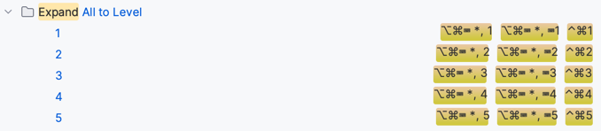

# Folding

### Collapse/Expand fold
⌘.
### Collapse all folds
⇧⌘-
### Expand all folds
⇧⌘+
### Expand all to level
Default shortcut uses NumLock character which we don't have macbook keyboard in the laptop.
Create new shortcuts using:

⌃⌘1, ⌃⌘2, ⌃⌘3, ⌃⌘4 and ⌃⌘5



## Custom Folding
### Create
Wrap the region with these comments:
```kotlin
// region [Region Name]
// TODO Code block
// endregion
```
### Navigate
⌥⌘.
